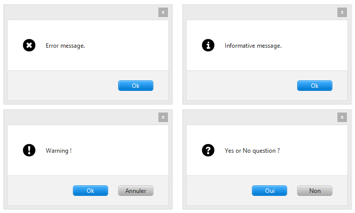

JavaFX-Dialog
=============

Dialogs for JavaFX 2.2.x

Samples
-------



Use
---

Simply create a new instance of Dialog and call `show()` or `showAndWait()` to display the dialog.

Dialog types :
* Error
* Warning
* Information
* Question

Dialog options (buttons)
* Ok
* Ok / Cancel
* Yes / No
* Yes / No / Cancel

Use DialogListener in the Dialog constructor to get the dialog response :
```
DialogListener listener = new DialogListener() {
  @Override
  public void onResponse(Dialog.DialogResponse response) {
    switch(response){
      case CANCEL: System.out.println("CANCEL"); break;
      case NO: System.out.println("NO"); break;
      case YES: System.out.println("YES"); break;
      case OK: System.out.println("OK"); break;
    }
  }
};
```

If a `Window` (like `Stage`) instance is gived in Dialog creation, the windows will block until the Dialog response.
